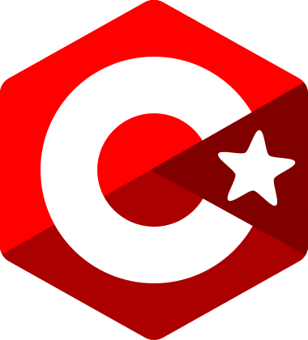

# C*

### About

An interpreter for an [ECS](https://en.wikipedia.org/wiki/Entity_component_system)-based [C](https://en.wikipedia.org/wiki/C_(programming_language))-style language.

## Compiling

Install the [Rust](https://www.rust-lang.org/) programming language's toolchain, then place yourself at the root of the repository and do:
```sh
cargo build --release
```

## Running

Still at the root of the repository, do:
```
cargo run --release -- examples/1-hello.cstar
```

This will run the `hello, world!` example of the `examples` directory. There are more examples for you to try in this directory.

## TODO

- [x] Finish first grammar
- [x] Use parser to build AST
- [ ] Treewalk the AST

## Bonus

- [ ] Type validation
- [ ] Increment/Decrement operators
- [ ] Return statements
- [ ] Functions and structs
- [ ] Switch statements
- [ ] Enums
- [ ] Pointers
- [ ] Arrays
- [ ] Imports and modules
- [ ] Ternary operator